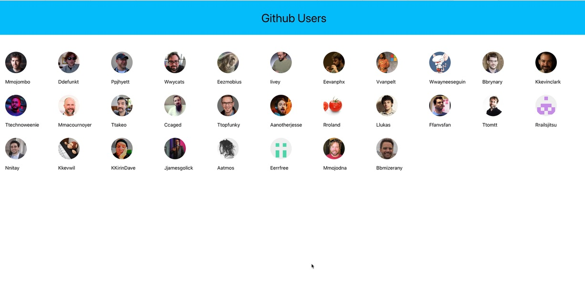
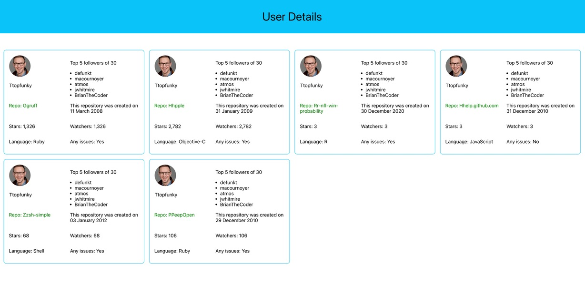
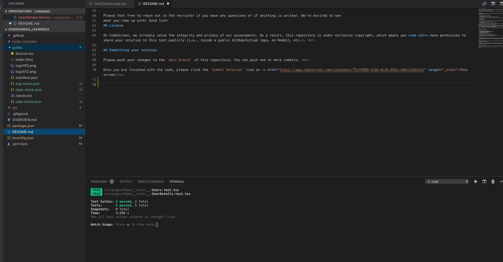

## The Project

The application will consist of two pages:

1. A Home Page, where I can see a list of users.
2. A User detail page, where I can view specific information for a user.

The home page will query the [users](https://api.github.com/users) endpoint and render each user that show

-  their avatar
-  their username

When I click on a user, I will be taken to a dedicated user detail page. On that page, I should see:

- their repos, which is the main content of the page.
- their organizations
- their first 5 followers, and include a count of total followers.

### Prerequisite
 yarn
 yarn start

 ### Prerequisite to run unit tests

 yarn start
 yarn test

I am using mocks due to GitHub rate limit issues, and these mocks are primarily intended for unit test cases. Before running 'yarn test,' please ensure that you've started the local server. 

There is an option to use Github api's too just uncomment and commnent these lines in each useHooks in hooks folder.

---useGetFollowers
    const getFetchFollowers = await fetch(`https://api.github.com/users/${userName}/followers`, {
   //const getFetchFollowers = await fetch('http://localhost:3000/user-mock.json', 

---useGetOrgs
   const getOrgs = await fetch(`https://api.github.com/users/${userName}/orgs`, {
   //const getOrgs = await fetch('http://localhost:3000/org-mock.json', {

---useGetUserRepos
   const getRepos = await fetch(`https://api.github.com/users/${userName}/repos?per_page=6&sort=updated`, {
   //const getRepos = await fetch('http://localhost:3000/repo-mock.json', {

--useGetUsers
   const getUsers = await fetch('https://api.github.com/users', {
   //const getUsers = await fetch('http://localhost:3000/user-mock.json', {

 

  
  
  

##  

### Author:
- [RAM GOTRU] (https://github.com/ramsgotrus)